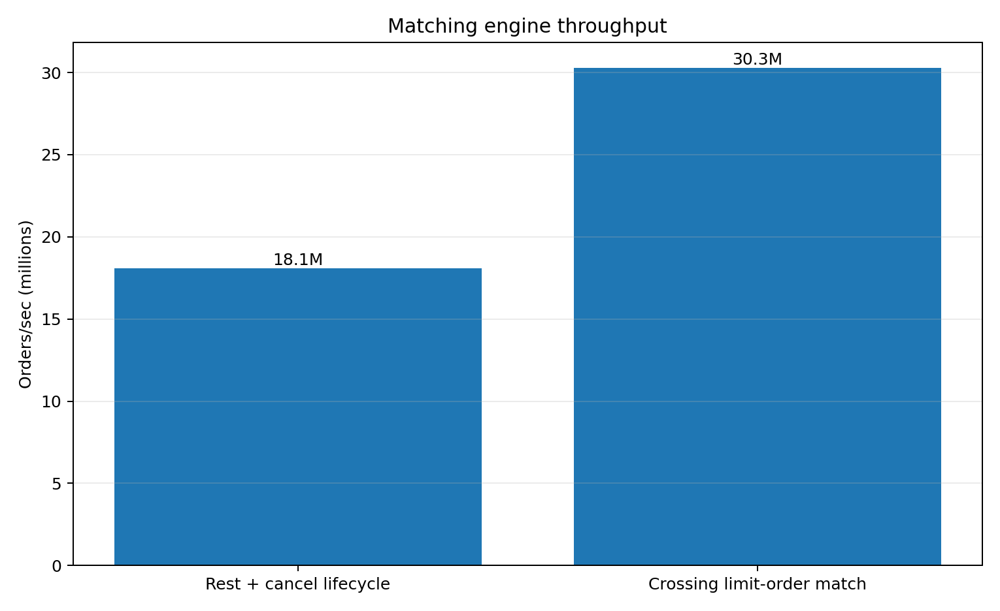
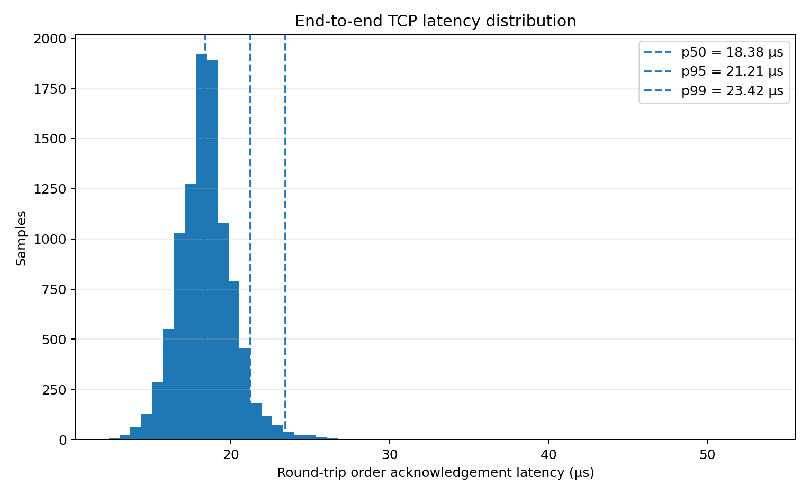
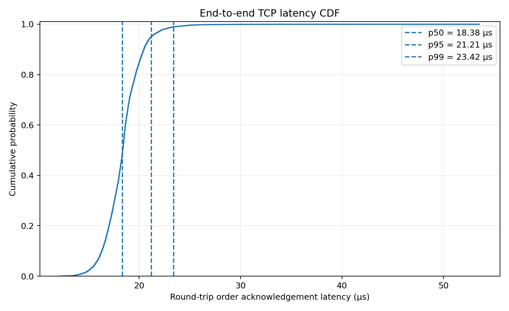
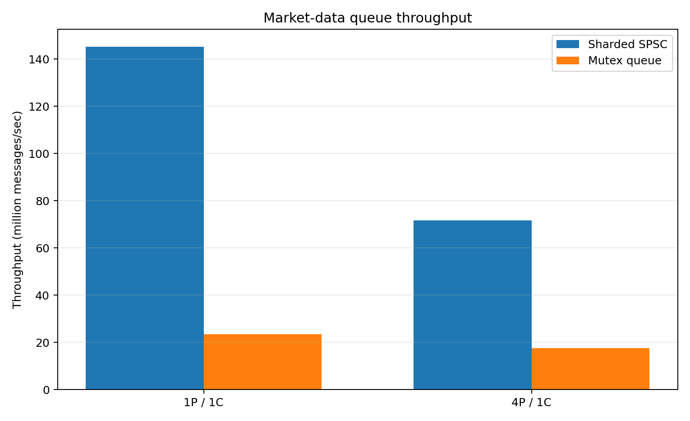
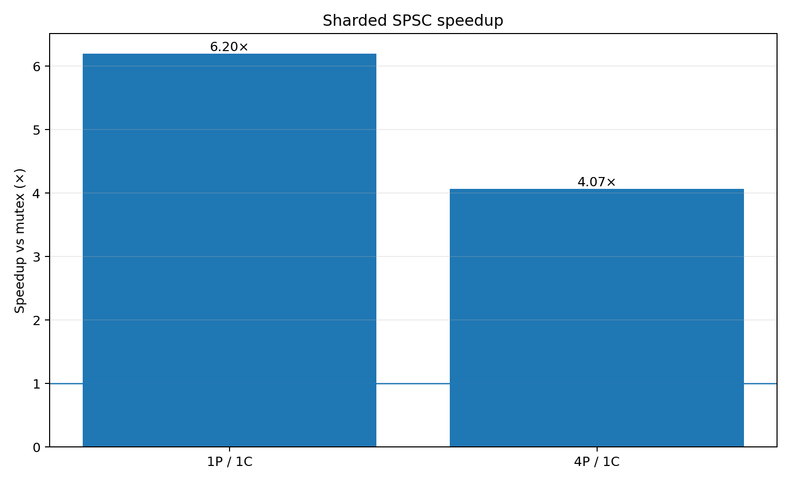
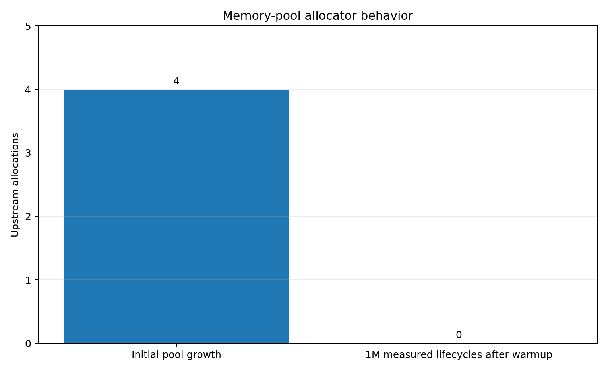

# ExchangeLab

A high-performance **C++20 exchange simulator and order-entry stack** built to study matching-engine design, low-latency systems, market-data delivery, risk controls, recovery, and exchange connectivity.

ExchangeLab implements a multi-symbol price-time-priority matching engine with binary TCP order entry, FIX 4.4 connectivity, pre-trade risk checks, UDP multicast market data, persistent journal recovery, pooled memory allocation, sharded SPSC handoff, live telemetry, a WebSocket gateway, a React dashboard, and Docker deployment.

---

## Performance

Benchmarks were run locally on the development machine using Release builds.

### Matching throughput

<p align="center">
  
</p>

| Benchmark | Result |
|---|---:|
| Crossing limit-order matching | **30.30M orders/sec** |
| Crossing trade throughput | **15.15M trades/sec** |
| Rest + cancel lifecycle | **18.09M orders/sec** |

### End-to-end TCP latency

Measured over **10,000 real order acknowledgements** after warmup.

| Metric | Latency |
|---|---:|
| Minimum | 12.291 µs |
| Mean | 18.416 µs |
| p50 | **18.375 µs** |
| p95 | **21.208 µs** |
| p99 | **23.417 µs** |
| Maximum | 53.500 µs |
| p99 / p50 | **1.27×** |

<p align="center">
  
  
</p>

The histogram and CDF are generated directly from the raw sample file written by the benchmark, not reconstructed from percentile summaries.

> These are localhost development-machine measurements intended for implementation comparison and tail-latency analysis, not colocated production-exchange latency claims.

---

## Architecture

```text
                        ┌─────────────────────┐
Binary TCP Client ─────►│                     │
        :9000           │                     │
                        │    Exchange Server   │
FIX Client ────────────►│                     │
        :9878           │                     │
                        └──────────┬──────────┘
                                   │
                         ┌─────────▼─────────┐
                         │  Pre-Trade Risk   │
                         └─────────┬─────────┘
                                   │
                         ┌─────────▼─────────┐
                         │  Matching Engine  │
                         └─────────┬─────────┘
                                   │
                      ┌────────────▼────────────┐
                      │ Multi-Symbol Order Books│
                      └────────────┬────────────┘
                                   │
                  ┌────────────────┼────────────────┐
                  │                │                │
                  ▼                ▼                ▼
            Journal/Replay    Sharded SPSC     Telemetry
                                  │                │
                                  ▼                │
                           UDP Multicast           │
                         239.255.0.1:9100           │
                                  │                │
                                  └───────┬────────┘
                                          ▼
                                 WebSocket Gateway
                                      :8080
                                          │
                                          ▼
                                  React Dashboard
                                      :3000
```

The matching core remains serialized for deterministic book mutation, while market-data publication is handed off to preallocated producer-local SPSC queues.

---

## Data Structures

| Structure | Purpose | Complexity |
|---|---|---|
| Ordered price-level containers | Maintain bid/ask prices in priority order | O(log N) insert/remove price level |
| FIFO queue per price level | Preserve time priority | O(1) append |
| Order ID index | Locate resting orders for cancel/replace | O(1) average lookup |
| PMR pool resource | Reuse order-book container storage | amortized pooled allocation |
| Reusable trade buffer | Avoid repeated trade-vector allocation | allocation-free after capacity is available |

Prices are represented as integers rather than floating point so tick comparisons are exact.

---

## Matching Engine

ExchangeLab uses **price-time priority**:

1. Better price executes first.
2. Orders at the same price execute FIFO.
3. Aggressive orders continue across available liquidity until filled or no longer marketable.

### Order types

| Type | Behavior |
|---|---|
| `LIMIT` | Executes at its limit price or better; eligible residual may rest |
| `MARKET` | Sweeps available opposite-side liquidity and never rests |

### Time in force

| TIF | Behavior |
|---|---|
| `GTC` | Residual remains on the book |
| `IOC` | Executes immediately and cancels residual |
| `FOK` | Executes only if the entire quantity is immediately available |

Cancel/replace is supported, including queue-priority loss when a replacement creates a new resting order.

---

## Multi-Symbol Books

A single server maintains independent books for multiple instruments.

The binary protocol includes a fixed-width symbol field, and the same numeric order ID may exist independently on different symbols.

Example:

```text
AAPL order 1
MSFT order 1
```

are distinct orders.

---

## Performance Engineering

### 1. Lock-free queue redesign

The first lock-free networking prototype used a shared multi-producer ring.

Its results were mixed:

| Workload | Shared MPSC | Mutex | Ratio |
|---|---:|---:|---:|
| 1 producer / 1 consumer | 127.94M msg/s | 22.45M msg/s | **5.70×** |
| 4 producers / 1 consumer | 12.74M msg/s | 17.93M msg/s | **0.71×** |

The shared producer index became a contention point under multiple producers, so that design was discarded.

The replacement uses **sharded SPSC queues**: every producer writes to its own queue and the publisher drains across shards.

<p align="center">
  
  
</p>

| Workload | Sharded SPSC | Mutex | Speedup |
|---|---:|---:|---:|
| 1 producer / 1 consumer | **145.25M msg/s** | 23.43M msg/s | **6.20×** |
| 4 producers / 1 consumer | **71.74M msg/s** | 17.63M msg/s | **4.07×** |

This is lock-free **producer-to-network-thread handoff**; the operating system's `sendto()` call itself is not claimed to be lock-free.

### 2. Allocation reduction

Allocation profiling showed the effect of reusable trade buffers:

| Scenario | Allocations | Bytes |
|---|---:|---:|
| Legacy single match | 1 | 40 |
| Buffered single match | **0** | **0** |
| Legacy 16-level sweep | 2 | 1280 |
| Buffered 16-level sweep | 1 | 640 |
| Reused buffer, 16-level sweep | **0** | **0** |

The PMR-backed order-book pool was then tested under churn:

- Warmup lifecycles: **50,000**
- Measured lifecycles: **1,000,000**
- Throughput: **19.02M lifecycles/sec**
- Upstream allocations during measured phase: **0**
- Upstream bytes during measured phase: **0**

<p align="center">
  
</p>

---

## Binary Order-Entry Protocol

ExchangeLab uses a compact custom binary protocol for order entry and exchange events.

**Protocol version: 3**

| Message | ID |
|---|---:|
| NewOrder | 1 |
| CancelOrder | 2 |
| ReplaceOrder | 3 |
| OrderAccepted | 100 |
| OrderRejected | 101 |
| OrderCancelled | 102 |
| OrderReplaced | 103 |
| TradeExecution | 104 |
| BookUpdate | 105 |
| Level3AddOrder | 200 |
| Level3OrderExecuted | 201 |
| Level3OrderDeleted | 202 |

Protocol integers are encoded little-endian.

TCP is used for order entry and private responses. Public book/L3 events are distributed separately over UDP multicast.

---

## Pre-Trade Risk Engine

Orders pass through pre-trade risk checks before entering the matching engine.

Controls include:

- Maximum order quantity
- Maximum order notional
- Maximum open orders per session
- Aggregate working quantity
- Maximum position by symbol
- Projected position including resting exposure
- Global kill switch
- Per-client kill switch
- Risk-aware replace handling

Cancels remain allowed while a kill switch is active so exposure can still be reduced.

Risk-rejected orders are not written to the journal.

---

## FIX 4.4 Gateway

```text
FIX Client
    │
    │ TCP :9878
    ▼
FIX 4.4 Gateway
    │
    │ ExchangeLab binary protocol v3
    ▼
Risk Engine
    │
    ▼
Matching Engine
```

Supported inbound messages:

- Logon
- Logout
- Heartbeat
- TestRequest
- NewOrderSingle (`D`)
- OrderCancelRequest (`F`)
- OrderCancelReplaceRequest (`G`)

Supported outbound messages:

- ExecutionReport (`8`)
- OrderCancelReject (`9`)
- Reject (`3`)

The gateway validates supported FIX framing, body length, checksum, and sequence numbers.

This is a focused FIX subset, not a certified production FIX stack. Full resend recovery, persistent FIX session state, TLS, and drop copy are outside the current scope.

---

## Market Data

Public market data is published over UDP multicast:

```text
239.255.0.1:9100
TTL: 1
```

The feed includes:

- Best bid / ask updates
- Level 3 order adds
- Level 3 executions
- Level 3 deletions

Private order acknowledgements and execution reports remain on the TCP order-entry connection.

---

## Persistence and Recovery

ExchangeLab uses an append-only journal.

At startup:

1. Existing journal records are replayed.
2. Symbol books are reconstructed.
3. The server opens the journal for new append operations.
4. Order entry begins.

This allows resting orders to survive process and Docker-container restarts.

The recovery boundary is deliberate: order state is persistent, but an old TCP socket is not a durable client identity.

---

## Live Performance Dashboard

The exchange emits performance telemetry once per second over loopback UDP.

The WebSocket gateway combines:

- multicast market data
- performance telemetry

and sends both to the browser.

The React dashboard displays:

- Multi-symbol book state
- Best bid / ask
- Midpoint
- Reconstructed visible Level 3 orders
- Event tape
- Orders/sec
- Executions/sec
- Matching p50 / p95 / p99
- Mean / max matching latency
- Active resting orders
- Connected clients
- Accepted / rejected orders
- Risk rejections
- Trade count / quantity
- Queue depth
- Queue high-water mark
- Drops / send errors
- Active producer shards
- 60-second sparklines

The WebSocket gateway is currently read-only; order entry stays on TCP or FIX.

---

## File Structure

```text
ExchangeLab/
├── .github/
│   └── workflows/                 # CI
├── benchmark-results/             # CSV benchmark output
├── benchmarks/                    # Latency, throughput, allocation benchmarks
├── dashboard/                     # React + Vite dashboard
├── docker/
│   ├── backend.Dockerfile
│   ├── backend-entrypoint.sh
│   ├── dashboard.Dockerfile
│   └── nginx.conf
├── docs/
│   └── figures/                   # Generated performance graphs
├── include/
│   └── exchange/                  # C++ headers
├── scripts/
│   └── plot_benchmarks.py         # Benchmark visualization
├── src/                           # Exchange implementation
├── tests/                         # Unit/integration tests
├── tools/                         # Clients, gateways, replay utilities
├── CMakeLists.txt
├── docker-compose.yml
└── README.md
```

---

## Build & Run

### Requirements

- C++20-capable compiler
- CMake
- macOS or Linux
- Node.js + npm for the dashboard
- Python 3 + Matplotlib for benchmark plots
- Docker Desktop / Docker Engine for container deployment

### Build

```bash
git clone https://github.com/Santoshi-Y/ExchangeLab.git
cd ExchangeLab

cmake -S . -B build-release -DCMAKE_BUILD_TYPE=Release
cmake --build build-release -j
```

### Run tests

```bash
ctest --test-dir build-release --output-on-failure
```

### Run the exchange

```bash
./build-release/exchange_lab
```

In another terminal:

```bash
./build-release/exchange_client
```

### FIX demo

```bash
./build-release/exchange_fix_gateway
./build-release/exchange_fix_client
```

### WebSocket gateway

```bash
./build-release/exchange_websocket_gateway
```

### Dashboard development server

```bash
cd dashboard
npm install
npm run dev
```

---

## Docker

The full stack can be deployed with Docker Compose.

```bash
docker compose up --build
```

Open:

```text
http://localhost:3000
```

Published ports:

| Service | Port |
|---|---:|
| React/Nginx dashboard | 3000 |
| WebSocket gateway | 8080 |
| Binary order entry | 9000 |
| FIX gateway | 9878 |

Check container status:

```bash
docker compose ps
```

Stop while preserving the journal volume:

```bash
docker compose down
```

Remove the persistent journal volume as well:

```bash
docker compose down -v
```

---

## Benchmark Reproduction

### End-to-end TCP latency

```bash
./build-release/exchange_lab_latency_benchmark
```

The benchmark writes all measured requests to:

```text
benchmark-results/end_to_end_latency.csv
```

with:

```csv
sample,latency_ns,latency_us
```

### Generate figures

```bash
python3 -m pip install -r requirements-plotting.txt
python3 scripts/plot_benchmarks.py
```

Figures are written to:

```text
docs/figures/
```

### Matching throughput

The measured throughput benchmark uses seven trials after warmup and reports median, p10, and p90 throughput.

Current median results:

```text
Rest + cancel lifecycle:      18.09M orders/sec
Crossing limit-order match:   30.30M orders/sec
Crossing trades:              15.15M trades/sec
```

---

## Tests & CI

The test suite covers:

- Price-time priority
- Full and partial fills
- Market orders
- IOC / FOK / GTC
- Cancel and replace
- Protocol encoding / decoding
- TCP order entry
- Execution reports
- Best bid / ask updates
- Level 3 market data
- Journal and replay
- Startup recovery
- Multi-symbol behavior
- Pre-trade risk
- FIX translation
- Memory-pool behavior
- Queue behavior
- WebSocket / publisher integration paths

GitHub Actions runs a matrix across:

```text
Ubuntu   × Debug
Ubuntu   × Release
macOS    × Debug
macOS    × Release
```

Performance benchmarks are kept separate from correctness tests so machine-dependent throughput does not become a CI pass/fail condition.

---

## Engineering Trade-offs

### Integer prices

Prices use integer storage instead of binary floating point, allowing exact tick comparisons.

### Serialized matching

Networking can be concurrent, but book mutation is controlled through a serialized matching path to keep state deterministic.

### Unsynchronized PMR pool

`std::pmr::unsynchronized_pool_resource` is used because order-book mutation is serialized, avoiding allocator synchronization that the matching path does not need.

### Sharded SPSC instead of shared MPSC

The shared MPSC prototype benchmarked worse than a mutex under four-producer contention. The design was replaced rather than defended theoretically.

### Event replay instead of memory snapshots

Recovery replays protocol events instead of persisting in-memory pointer/container layouts, keeping journal data independent of allocator internals.

---

## Current Limitations

ExchangeLab is intentionally not presented as production exchange infrastructure.

Current limitations include:

- FIX support is a subset
- No TLS on demo connectivity
- No durable socket/client identity across restart
- No HA, replication, or leader election
- No kernel-bypass networking
- No hardware timestamping
- WebSocket gateway is read-only
- Benchmark results are localhost development-machine measurements

---

## Future Work

Potential next steps:

- Historical market replay at scale
- Queue-position analytics
- Fill-probability estimation
- Order-book imbalance and microprice research
- Latency vs book depth / cancel-to-trade ratio
- Property-based testing
- Linux `perf`, Cachegrind, and flame-graph profiling
- Snapshot + incremental market-data recovery
- Durable account/session identity
- More complete FIX session recovery

---

## Project Goal

ExchangeLab is meant to be more than a working order book.

The project studies how exchange infrastructure changes when you care about:

**latency · allocation · concurrency · risk · recovery · connectivity · observability**

The guiding principle is:

> **Measure first, then optimize.**
